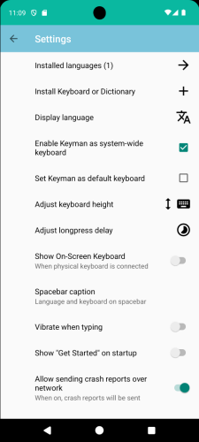
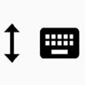

## Using the Settings Screen

This Settings screen is used to configure keyboards and dictionaries.
It also has many of the options that are available on the 'Get Started' menu. To access the Settings screen:

Step 1)
Open the Keyman app.

Step 2)
Click the menu for additional options. Select 'Settings'

Each selection on the Keyman Settings screen is described in further detail below:

## Installed Languages
This displays the number of installed languages in parentheses `()`. Click this line for the 'Installed Languages'
screen where you can [install new keyboards](../../start/installing-keyboards) from the keyman.com catalog.

## Install Keyboard or Dictionary

Click on this to display a [menu](install-keyboard-or-dictionary) that has a few ways to install a keyboard package or dictionary package.

## Change Display Language

Click on this to change the display language of the Keyman for Android app. The list of available languages come from [translate.keyman.com](https://translate.keyman.com). If a translation is available, Keyman for Android will default to the device's default locale.

## Enable Keyman as system-wide keyboard
By default, installed Keyman keyboards are only available to use within the Keyman app. Click on this setting to
bring up the Android system configuration so Keyman can be added as a system-wide keyboard.

## Set Keyman as default keyboard
Click on this to bring up the Android system configuration for setting Keyman as the default system-wide keyboard.

## Adjust Keyboard Height

Click on this to [adjust the keyboard height](adjust-keyboard-height).

## Adjust longpress delay

Click on this to [adjust the delay time](adjust-longpress-delay) for a longpress gesture.

## Show On-Screen Keyboard
By fefault, Android API 36+ won't display the On-Screen keyboard if a physical keyboard is connected. When enabled, show the Keyman system keyboard even if a physical keyboard is connected.

## Spacebar Caption
Click on this to [change the displayed keyboard name](spacebar-caption) on the spacebar.

## Vibrate When Typing
When enabled, the Keyman keyboard will provide haptic feedback (vibrate) when the user presses a key and generates output. The default preference is off.

## Show "Get Started" on startup
When enabled, the Keyman app will display the 'Get Started' screen on app startup.

## Allow sending crash reports over network
When enabled, the Keyman app will send crash reporting information to [Sentry](https://keyman.sentry.io). No personally identifiable information or keyboard strokes are recorded.